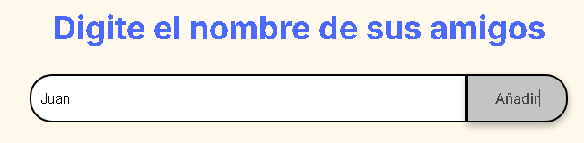
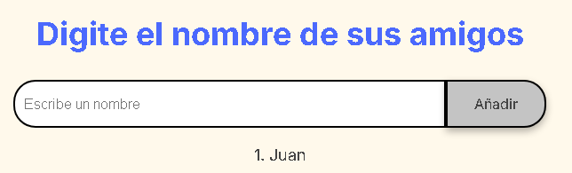

# amigo-secreto
Ejercicio/Desafio ONE amigo secreto para poner en practica 
las bases de la  lógica de programacion en Javascript

<h1 align="center"> AMIGO SECRETO </h1>

# Insignias
    Javacript  HTML   CSS

    

   
   

#	Descripción de su proyecto;
En la aplicacion/juego puedes capturar el nombre de tus amigos
y una vez que termines de capturar a todos tus amigos
puedes esoger uno al azar que sera tu  "Amigo Screto"

#   Estado del Proyecto:  
   <h4 align="center">
:construction: Proyecto en construcción :construction:
</h4>

# Version
  0.2  Febrero 2025

#	Funcionalidades;
en la parte de javascript, el programa tiene  5 funciones

- Funcion agregarAmigo()
    si el nombre es valido
    -que no sea una cadena vacia
    -que el nombre no empiece con numeros
    entonces lo agrega a  la lista lista_amigos
    y lo muestra en pantalla

- Funcion mostrarLista(lista)
    muestra los nombres que contiene Lista_amigos

- Funcion numeroAzar(lista)
    genera un numero aleatorio entre
    0 y la longitud de lista_amigos

-  Funcion sortearAmigo()
    verifica que la lista no este vacia 
    y que al menos tenga 3 nombres
    si cumple estas condiciones
    escoge al azar uno de los nombres de lista_amigos

- Function reiniciarJuego()
    reinicia el juego

#	Cómo pueden usarlo los usuarios;
para el usaurio en la pantalla se muestra una caja de texto, 
donde puede capurar el nombre de un amigo.

al pulsar el boton añadir, el nombre del amigo se agregara a una lista y se motrara en la parte inferior

asi puedes continuar agregando mas nombres de amigos.
cuando termines de agregar el nombre de tus amigos, (se iran mostrando una lista en la pantalla) 

al pulsar el boton Sortear Amigo, para escoger un amigo de la lista al azar, que sera tu amigo secreto y se mostra en pantalla en color verde

puedes reiniciar el programa/juego pulsando el boton Reinciar Juego.

No ser permiten agregar cadenas vacias
ni nombres que que empiecen con numeros

debes por lo menos agregar 3 nombres de amigos para poder
escoger uno al azar

# Acceso al proyecto
Se puede descargar der
https://github.com/IngRodrigoPena/amigo-secreto

#   Tecnologias Usadas
    Javacript  HTML   CSS Git   GitHub

#	Donde los usuarios pueden encontrar ayuda sobre su proyecto;
para dudas favor de enviar un email a rpena73gmail.com
favor de enviar una descripcion y una captura de pantalla
a la brevedad me pondre en contacto

#	Autores del proyecto.
Rodrigo Peña Ramírez

#	Licencia
 Chocolate   

